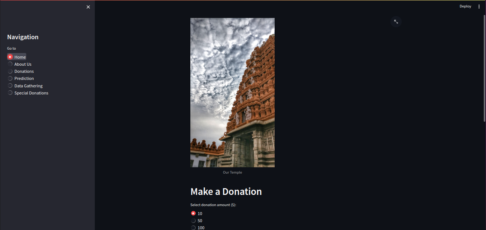

To run a Streamlit application, you need to follow these general steps:



1. **Install Streamlit:**

   If you haven't installed Streamlit yet, you can do so using `pip`. Open a terminal and run:

   ```bash
   pip install streamlit
   ```

2. **Run Your Streamlit App:**

   In the terminal, navigate to the directory containing your `app.py` file and run:

   ```bash
   streamlit run app.py
   ```

   Replace `app.py` with the actual filename of your Streamlit application script.

3. **View Your App:**

   After running the command, Streamlit will provide a local server URL (usually starting with `http://localhost:8501`). Open this URL in your web browser to view your Streamlit application.

   Streamlit will automatically detect changes to your script and update the app in real-time as you save edits.

4. **Stop the Server:**

   To stop the Streamlit server, you can press `Ctrl + C` in the terminal.

Streamlit provides a simple and efficient way to create data apps with Python. You can enhance your Streamlit app by adding interactive widgets, visualizations, and more. The [official Streamlit documentation](https://docs.streamlit.io) is an excellent resource for learning about the various features and capabilities available in Streamlit.
